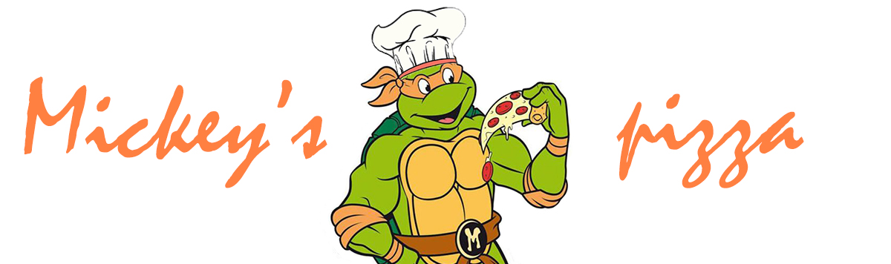
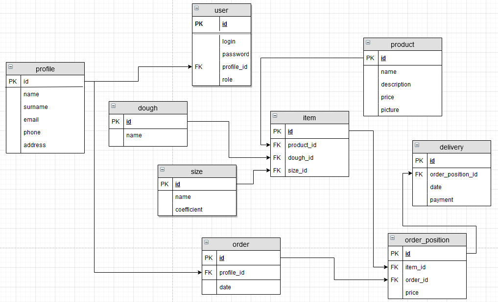

Финальный проект
--
 

Технические подробности:
--
1. Java EE (Servlets, JSP);
2. Контейнер сервлетов — Tomcat 9;
3. База данных — MySQL;
4. Архитектура — Layered architecture;
5. Соединение с базой данных — JDBC;
6. Реализована защита от sql injection;
7. Доступна локализация — EN | RU | BE;
8. Логгер — Log4j2;
9. Для хранения пользовательской информации между запросами использована сессия;
10. Использованы фильтры;
11. При реализации JSP использованы JSTL;
12. Использованы AJAX, js;
13. Реализована защита от повторного запроса F5;
14. Реализована валидация;
15. Реализованы пользовательские теги;
16. Тестирование — TestNG;
17. Сборщик проектов — Maven.

Описание проекта:
--
Данное веб-приложение предназначено для онлайн-заказа пиццы, закусок и напитков.
Из перечня товаров можно выбрать для всех — размер, для пиццы — вдобавок тесто.
Есть возможность пополнить корзину несколькими товарами и заказать с учетом места доставки
и времени.
---
Реализованы 3 роли:
1. Клиент
2. Создатель;
3. Администратор;
---
Неавторизованный пользователь может выбрать товары и заказать их, предварительно заполнив форму пользователя с
указанием имени, фамилии, телефона и адреса.

Клинет может:
1. Зарегистрироваться или зайти в свой аккаунт;
2. Создать профиль;
3. Редактировать профиль;
4. Менять пароль;
5. Выбирать позиции заказа;
6. Делать заказ на определенную дату.

В отличие от неавторизованного пользователя, клиент может не заполнять форму, так как она сохранена в
его профиле. В будущем планируется внедрить
систему баллов и соответствующих скидок для клиентов в зависимости от суммы предыдущих покупок.

---
Создатель может:
1. Создавать новые позиции меню;
2. Редактировать существующие позиции;
3. Удалять позиции.

Создателю также доступны действия клиента.

---
Администратор может:
1. Просматривать таблицы.
2. Просматривать статистику.
3. Удалять пользователей, заказы, позиции заказов, доставки.
4. Изменять роль пользоватей;
5. Изменять данные о заказе;
6. Изменять время и способ доставки.

Администратору также доступны действия создателя.

---
При проектировании вдохновлялся "Папа Джонс" и "Пицца Лисицца".

---
В будущем планируется ввести скидочную систему, возможность создавать пиццу из ингредиентов,
восстановление пароля.

Для входа как администратор - "admin", "admin"
Создатель - "creator", "creator"
Клиент - "client", "client".

 